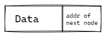

# Linked List
Linked List is a data structure consisting of a group of vertices (nodes) which together represent a sequence. Under the simplest form, each vertex is composed of a data and a reference (link) to the next vertex in the sequence.

This structure allows for efficient insertion or removal of elements from any position in the sequence during iteration

**Single node of a Linked List** 

***Linked List and its variations are used as underlying data structure to implement List, Stack, Queue, and Deque ADTs***

The items in a linked list are ordered from index 0 to index N-1 by associating item i with its neighbour item i+1 through a pointer.

### Note:
A drawback of linked lists is that access time is linear (and difficult to pipeline). Faster access, such as random access, is not feasible. Arrays have better cache locality as compared to linked lists.

## Complexities

### Time Complexity

| Access    | Search    | Insertion | Deletion  |
| :-------: | :-------: | :-------: | :-------: |
| O(n)      | O(n)      | O(1)      | O(n)      |

### Space Complexity

O(n)

## Visualizations of Linked List
[LinkedList](https://visualgo.net/en/list?slide=3)

